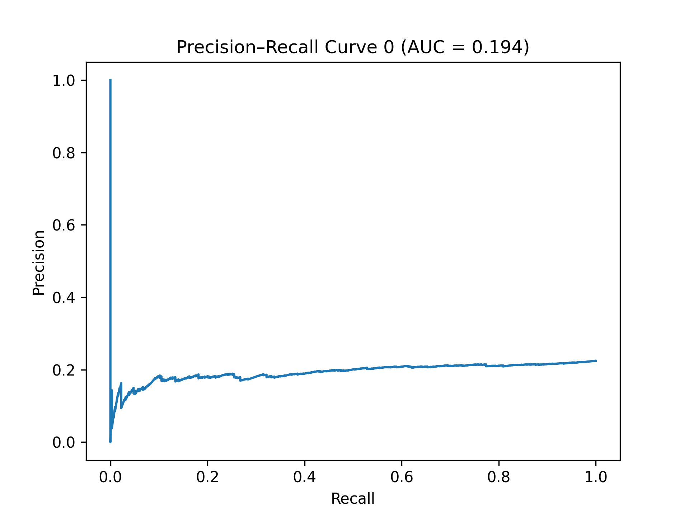
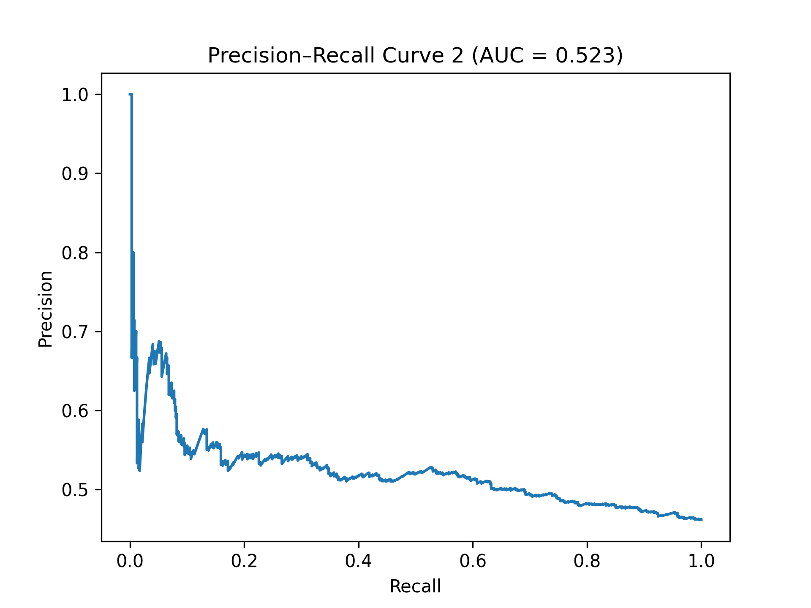
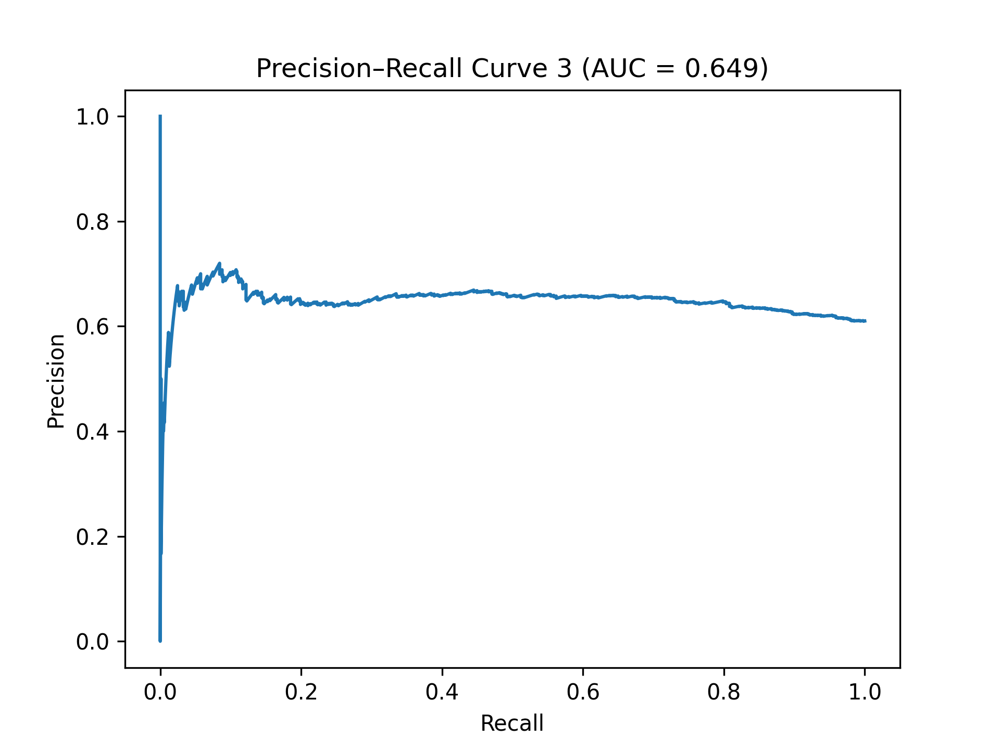

# ML-Final-Project
Personality Type Predictor

# ML-Final-Project

Our project aims to predict a Reddit user's **MBTI personality type** from their posts using **BERT-based models** where we split MBTI prediction into four binary classification tasks for simpler training and modular evaluation

---

## Project Description

MBTI has four dimensions:

- **E/I** – Extroversion / Introversion  
- **S/N** – Sensing / Intuition  
- **T/F** – Thinking / Feeling  
- **J/P** – Judging / Perceiving  

Instead of a 16-class classification problem, the task is split into **four independent binary classification tasks**, one per dimension to simplify training.

**BERT (Bidirectional Encoder Representations from Transformers)** is a pretrained language model we chose to apply for our problem task. Key features of the model include:
- **Bidirectional context**: Understands words based on left and right context
- **Transformer-based**: Uses self-attention to capture long-range dependencies 
- **Pretrained**: Learns general language patterns from large corpora 
- **Fine-tunable**: Can be adapted for downstream tasks like classification

As Reddit posts and texts contain nuanced language, BERT captures semantic relationships and context, making it ideal for personality prediction. For the inital milestone, we use `prajjwal1/bert-tiny` for fast experimentation and testing.

---

## Dataset Requirements

- File: `data/reddit_post.csv`  --> from Kaggle: https://www.kaggle.com/datasets/minhaozhang1/reddit-mbti-dataset
- Required columns:
  - `mbti` – MBTI type (e.g., INTJ, ENFP)  
  - `body` – Reddit post text  
---

## MBTI Dimension Encoding

| Dimension | Encoding |
|-----------|---------|
| E/I       | I → 0, E → 1 |
| S/N       | S → 0, N → 1 |
| T/F       | T → 0, F → 1 |
| J/P       | J → 0, P → 1 |

Each dimension is treated as an independent binary classification task.

---

## Model

- **Tokenizer**: `BertTokenizer`  
- **Model**: `BertForSequenceClassification`

Inputs:
- `input_ids` – token indices  
- `attention_mask` – mask for real tokens
- 
For each dimension:

1. Initialize a BERT classifier  
2. Train for `NUM_EPOCHS` with AdamW optimizer
3. Compute cross-entropy loss  
4. Backpropagate and update weights  
5. Evaluate accuracy on the test set

Example code:

```python
for epoch in range(NUM_EPOCHS):
    for batch in train_loader:
        optimizer.zero_grad()
        input_ids = batch[0].to(DEVICE)
        attention_mask = batch[1].to(DEVICE)
        labels = batch[2][:, i].to(DEVICE)

        outputs = model(
            input_ids=input_ids,
            attention_mask=attention_mask,
            labels=labels
        )
        loss = outputs.loss
        loss.backward()
        optimizer.step()
```
## Evaluation

- Accuracy is computed per dimension using `sklearn.metrics.accuracy_score`.  
- Batch tokenization is used for efficiency.  
- Independent evaluation highlights which MBTI dimensions are easier or harder to predict.

---

## Prediction

Steps to predict a new post:

1. Tokenize the text  
2. Feed it into each trained model  
3. Map binary outputs to MBTI letters  
4. Concatenate letters for the final MBTI type

**Example:**

```

---

## Configuration

```python
NUM_EPOCHS = 2
MAX_LEN = 128
BATCH_SIZE = 8
MODEL_NAME = "prajjwal1/bert-tiny"
DEVICE = "cuda" if torch.cuda.is_available() else "cpu"
```

`NUM_EPOCHS` – training epochs
`MAX_LEN` – maximum token length
`BATCH_SIZE` – batch size
`MODEL_NAME` – pretrained BERT variant


## Running the script


```
python model.py

```
Load and preprocess the dataset
Train four BERT classifiers (one per MBTI dimension)
Evaluate each model
Predict the MBTI type for a sample post

 ## Our Output
 ```
  Training model for E_I...
  Some weights of BertForSequenceClassification were not initialized from the model checkpoint at prajjwal1/bert-tiny and are newly initialized: ['classifier.bias', 'classifier.weight']
  You should probably TRAIN this model on a down-stream task to be able to use it for predictions and inference.
  Epoch 1 done, Loss: 0.6925
  Epoch 2 done, Loss: 0.7044
  Epoch 3 done, Loss: 0.7487
  
  Evaluating model...
  Accuracy: 0.5986
  PR AUC:  0.1944
  
  Training model for S_N...
  Some weights of BertForSequenceClassification were not initialized from the model checkpoint at prajjwal1/bert-tiny and are newly initialized: ['classifier.bias', 'classifier.weight']
  You should probably TRAIN this model on a down-stream task to be able to use it for predictions and inference.
  Epoch 1 done, Loss: 0.5469
  Epoch 2 done, Loss: 0.3736
  Epoch 3 done, Loss: 0.5740
  
  Evaluating model...
  Accuracy: 0.5764
  PR AUC:  0.9330
  
  Training model for T_F...
  Some weights of BertForSequenceClassification were not initialized from the model checkpoint at prajjwal1/bert-tiny and are newly initialized: ['classifier.bias', 'classifier.weight']
  You should probably TRAIN this model on a down-stream task to be able to use it for predictions and inference.
  Epoch 1 done, Loss: 0.6766
  Epoch 2 done, Loss: 0.6377
  Epoch 3 done, Loss: 0.6287
  
  Evaluating model...
  Accuracy: 0.5529
  PR AUC:  0.5233
  
  Training model for J_P...
  Some weights of BertForSequenceClassification were not initialized from the model checkpoint at prajjwal1/bert-tiny and are newly initialized: ['classifier.bias', 'classifier.weight']
  You should probably TRAIN this model on a down-stream task to be able to use it for predictions and inference.
  Epoch 1 done, Loss: 0.6997
  Epoch 2 done, Loss: 0.7109
  Epoch 3 done, Loss: 0.6770
  
  Evaluating model...
  Accuracy: 0.5429
  PR AUC:  0.6491
  
  Post: Ok ya not sure if this model is actually predicting anything
  Predicted MBTI: ISTP
  
  Post: I love leading teams and planning long-term goals.
  Predicted MBTI: ENTP
  
  Post: I really enjoy spending time alone thinking about ideas.
  Predicted MBTI: ISTJ
  
  Post: whatever this is sooo annoying
  Predicted MBTI: INTP
  
  Post: Wait Im actually so excited for thiss
  Predicted MBTI: ISFP
 ```

 ## Our Evaluation Graphs


**Figure 1:** E/I Precision-Recall Curve


**Figure 2:** S/N Precision-Recall Curve



**Figure 3:** T/F Precision-Recall Curve



**Figure 4:** J/P Precision-Recall Curve


 
 ## Potential Improvements

1. **Larger Models** – `bert-base` for better performance  
2. **More Data** – Train on the full dataset  
3. **Hyperparameter Tuning** – Optimize learning rate, batch size, and epochs  
4. **Additional Metrics** – F1-score, precision, recall
5. 
---

## Summary

This project demonstrates machine learning pipeline for predicting MBTI personality types from text data using transformer-based models:

- **Fine-tuning BERT**: Adapting a pretrained language model to a specific task 
- **Decomposing a multi-class problem into binary tasks**: Instead of predicting all 16 MBTI types at once, the problem is split into four independent binary classification tasks corresponding to each MBTI dimension (E/I, S/N, T/F, J/P) to improve training stability and interpretability  
- **Transformer-based personality prediction**: Utilizes contextualized embeddings from BERT to capture semantic nuances in text data and improving classification performance compared to traditional methods
- **Potential for extension**: We plan to apply our current models to train and learn for other personality trait tests such as OCEAN


