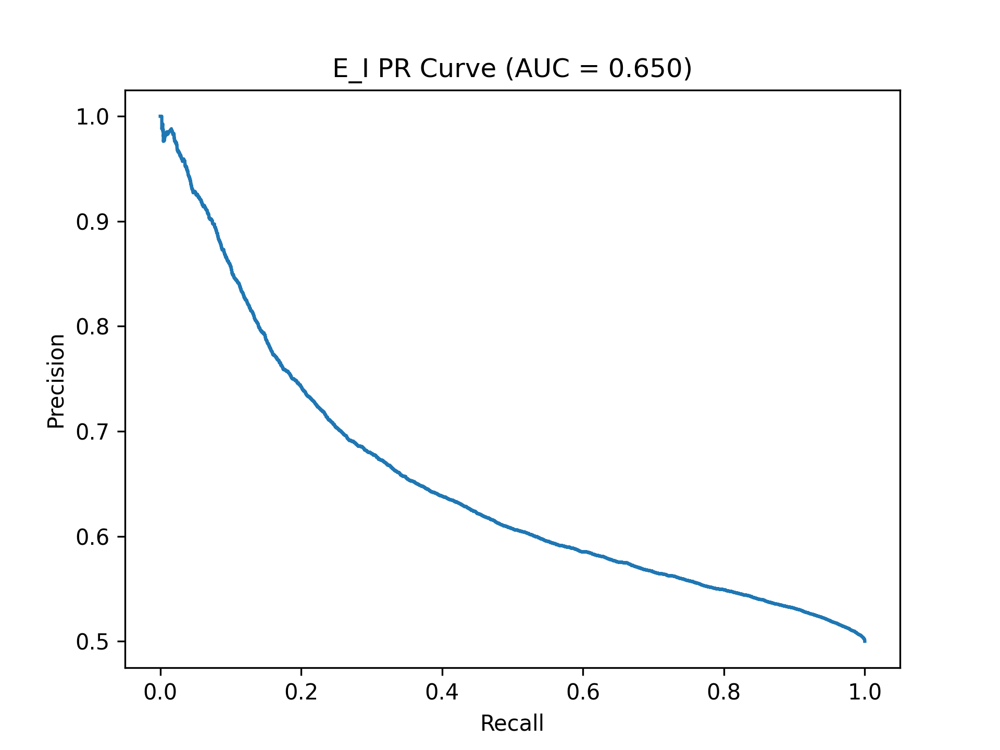
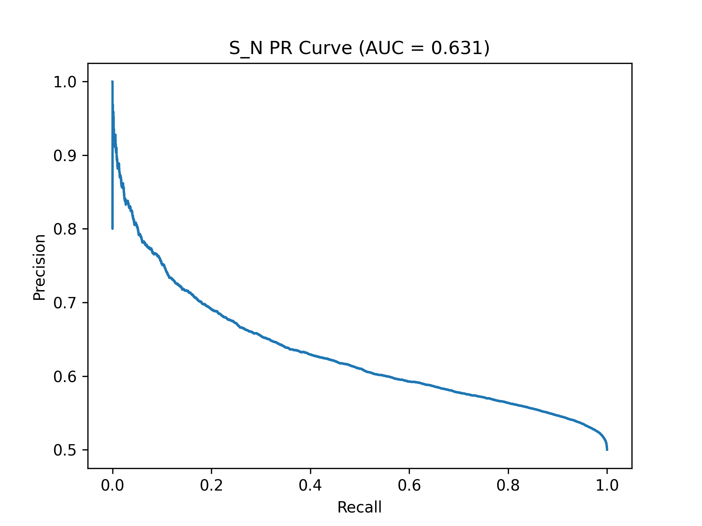
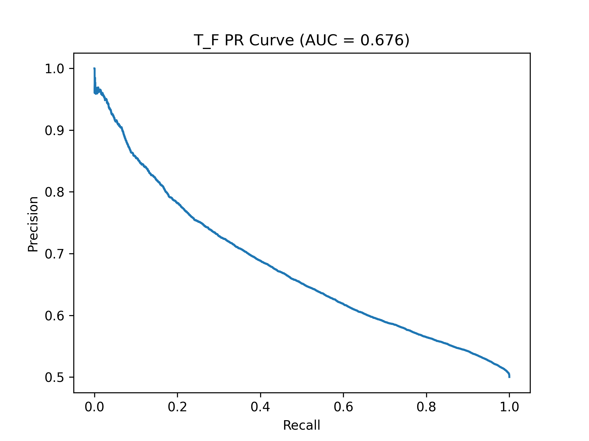
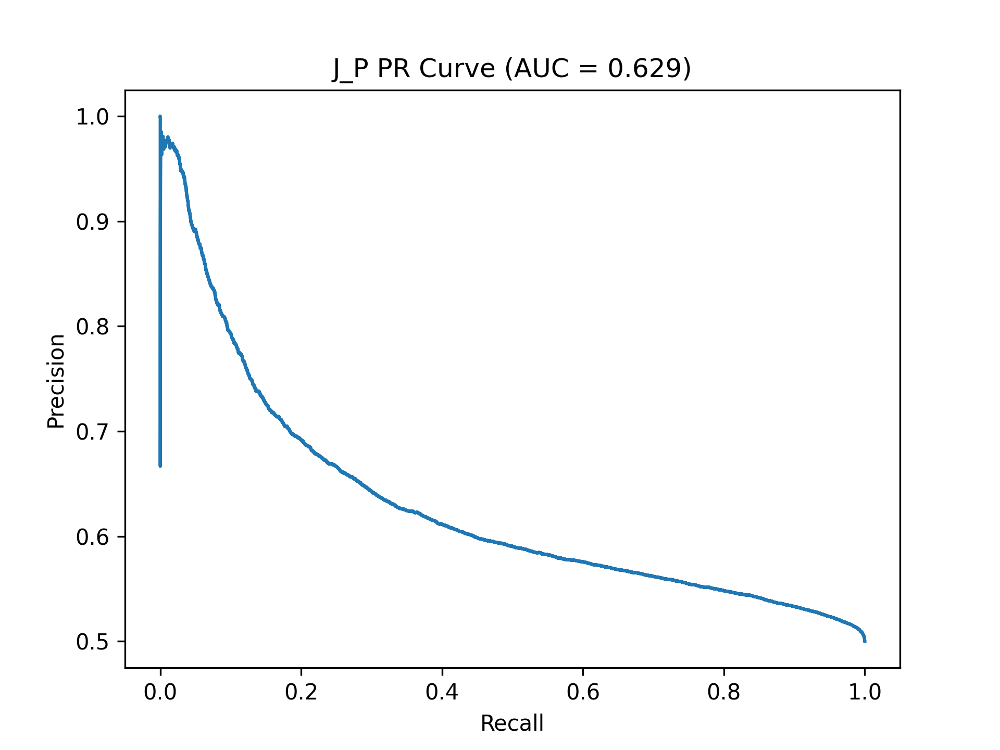

# ML-Final-Project

# Predicting Personality from Text: MBTI vs. Big Five

This project investigates to what extent personality traits can be inferred from short-form online text using machine learning, and how predictive performance differs between categorical personality frameworks (MBTI) and continuous trait frameworks (Big Five / OCEAN). Using Reddit posts as naturalistic text data, we fine-tune ***BERT-based models*** to predict personality dimensions directly from language.

Our results show that personality prediction consistently exceeds chance, confirming that online language contains weak but detectable personality signals. Performance is stronger for MBTI, where stable categorical boundaries simplify prediction, while Big Five regression proves more challenging due to its continuous nature and the noise inherent in short, informal posts. Overall, pretrained transformers reliably extract psychologically meaningful cues from social media text.

---

 ## Our Output

 **MBTI:**
 ```

 ```

**Big Five:**
```
Found cached dataset parquet (/home/ajeon/.cache/huggingface/datasets/jingjietan___parquet/jingjietan--pandora-big5-a15fb551a07059a5/0.0.0/2a3b91fbd88a2c90d1dbbb32b460cf621d31bd5b05b934492fdef7d8d6f236ec)
100%|███████████████████████████████████████████████████████████████████████████████████████████████████████████████| 3/3 [00:00<00:00, 35.62it/s]
Loading cached shuffled indices for dataset at /home/ajeon/.cache/huggingface/datasets/jingjietan___parquet/jingjietan--pandora-big5-a15fb551a07059a5/0.0.0/2a3b91fbd88a2c90d1dbbb32b460cf621d31bd5b05b934492fdef7d8d6f236ec/cache-876e825749d1757a.arrow
Loading cached shuffled indices for dataset at /home/ajeon/.cache/huggingface/datasets/jingjietan___parquet/jingjietan--pandora-big5-a15fb551a07059a5/0.0.0/2a3b91fbd88a2c90d1dbbb32b460cf621d31bd5b05b934492fdef7d8d6f236ec/cache-c1d58c487ec3ad21.arrow
Loading cached shuffled indices for dataset at /home/ajeon/.cache/huggingface/datasets/jingjietan___parquet/jingjietan--pandora-big5-a15fb551a07059a5/0.0.0/2a3b91fbd88a2c90d1dbbb32b460cf621d31bd5b05b934492fdef7d8d6f236ec/cache-fafafed0ff4862cd.arrow
Epoch 1 | Train: 0.0445 | Val: 0.0428 | R2: 0.041
Epoch 2 | Train: 0.0413 | Val: 0.0424 | R2: 0.050
Epoch 3 | Train: 0.0359 | Val: 0.0434 | R2: 0.027
Epoch 4 | Train: 0.0287 | Val: 0.0471 | R2: -0.054
Early stopping triggered.
/home/ajeon/untitled.py:186: FutureWarning: You are using `torch.load` with `weights_only=False` (the current default value), which uses the default pickle module implicitly. It is possible to construct malicious pickle data which will execute arbitrary code during unpickling (See https://github.com/pytorch/pytorch/blob/main/SECURITY.md#untrusted-models for more details). In a future release, the default value for `weights_only` will be flipped to `True`. This limits the functions that could be executed during unpickling. Arbitrary objects will no longer be allowed to be loaded via this mode unless they are explicitly allowlisted by the user via `torch.serialization.add_safe_globals`. We recommend you start setting `weights_only=True` for any use case where you don't have full control of the loaded file. Please open an issue on GitHub for any issues related to this experimental feature.
  model.load_state_dict(torch.load("best_psychbert_big5.pt"))

Big Five Regression Metrics:
O: MSE=949.516 | MAE=27.084 | R2=0.034
C: MSE=670.930 | MAE=21.251 | R2=0.049
E: MSE=876.168 | MAE=25.510 | R2=0.004
A: MSE=821.329 | MAE=24.252 | R2=0.094
N: MSE=910.631 | MAE=25.791 | R2=0.055

Post: Yes I completely agree with you! That is a great first step to take to be successful in the computer science department, please let me know if you need more help!
O=59.82 (High), C=70.80 (High), E=45.61 (Low), A=48.33 (Low), N=47.30 (Low)

Post: I don’t think that approach will work. We need to be more logical and stick to the data.
O=40.61 (Low), C=73.86 (High), E=44.65 (Low), A=42.64 (Low), N=37.83 (Low)

Post: Wow, that’s such a cool idea! I never thought of it that way before.
O=51.32 (High), C=62.14 (High), E=50.41 (High), A=37.20 (Low), N=56.67 (High)

Post: I’ve made a detailed plan for the project timeline. Everyone, please review it carefully.
O=58.34 (High), C=61.08 (High), E=46.98 (Low), A=34.03 (Low), N=50.19 (High)

Post: Honestly, I just go with my gut on things. Planning too much stresses me out.
O=46.94 (Low), C=68.09 (High), E=53.02 (High), A=51.00 (High), N=38.00 (Low)

Post: That’s really insightful. I think there’s a bigger pattern here if we look closely.
O=46.67 (Low), C=69.50 (High), E=45.01 (Low), A=38.57 (Low), N=40.62 (Low)

Post: I love brainstorming all the possibilities. No idea is too wild.
O=55.20 (High), C=74.21 (High), E=51.87 (High), A=52.63 (High), N=38.19 (Low)

Post: Please make sure to follow the instructions exactly. Precision matters.
O=40.10 (Low), C=65.28 (High), E=47.31 (Low), A=41.40 (Low), N=39.67 (Low)

Post: I prefer to work alone on this task. Group work slows me down.
O=46.60 (Low), C=66.50 (High), E=53.17 (High), A=34.67 (Low), N=43.80 (Low)

Post: Honestly, I don’t care about the rules as long as we have fun doing it.
O=44.83 (Low), C=57.81 (High), E=44.98 (Low), A=37.88 (Low), N=50.25 (High)

Post: I’ve noticed a trend in the data that might help us predict outcomes more accurately.
O=52.25 (High), C=69.28 (High), E=48.99 (Low), A=40.34 (Low), N=34.32 (Low)

Post: We should just try everything and see what works best.
O=47.33 (Low), C=63.56 (High), E=45.55 (Low), A=37.56 (Low), N=49.02 (Low)

==============================
OCEAN ACCURACY & PR AUC SCORES
==============================

--- RAW OCEAN (Binary: Low vs High) ---
O: Accuracy=0.5929 | PR AUC=0.5487
C: Accuracy=0.7249 | PR AUC=0.7874
E: Accuracy=0.6722 | PR AUC=0.3997
A: Accuracy=0.6819 | PR AUC=0.4899
N: Accuracy=0.5903 | PR AUC=0.6341

--- BINNED OCEAN (10 Bins) ---
O: Accuracy=0.0839 | PR AUC=0.1031
C: Accuracy=0.1226 | PR AUC=0.1014
E: Accuracy=0.1040 | PR AUC=0.1009
A: Accuracy=0.1062 | PR AUC=0.1085
N: Accuracy=0.1049 | PR AUC=0.1039
```

 ## Our Evaluation Graphs

 **MBTI:**
 


**Figure 1:** E/I Precision-Recall Curve



**Figure 2:** S/N Precision-Recall Curve



**Figure 3:** T/F Precision-Recall Curve



**Figure 4:** J/P Precision-Recall Curve

**Big Five:**

**ADD THE GRAPHS OUR FINAL MODEL WILL OUTPUT**

## Replication Instructions

**1. Clone this repository:**
   ```
   git clone https://github.com/paigemizutani/ML-Final-Project.git
   ```
   ```
   cd ML-Final-Project
   ```
**2. Install the required libraries:**
   ```
   pip install torch transformers datasets pandas numpy scikit-learn matplotlib seaborn scipy tqdm
   ```
**3. Prepare the Datasets**

   **MBTI**
   - The balanced MBTI datasets used in our experiments is already included in the repository as preprocessed CSV files under `data/balanced`.
   - These files were generated during development and are provided to allow direct replication of results without rerunning `mbti_data_setup.py`.
   - To reproduce our results, no additional MBTI data setup is required.

   **Big Five**
   - For the Big Five model, dataset preparation is handled automatically within the training script.
   - The code downloads and processes the Pandora-Big5 Reddit dataset from Hugging Face and creates the required train/validation/test splits at runtime.
   - No manual data preparation is required.

**4. For Generating Predictions on New Text**

Both models support inference on new, raw text inputs. To input your own text edit the `new_posts` lists in `mbti_model.py` and `big5_model.py`.

**5. Run Training and Evaluation**

  Train and evaluate the MBTI model:
  ```
  python mbti_model.py
  ```
  Train and evaluate the Big Five model:
  ```
  python big5_model.py
  ```
  Each script trains a BERT-based model, evaluates performance on the test set, and outputs relevant metrics and visualizations.
 
  Note: We trained our models using Colgate University's super computer, and even with GPU acceleration, full training runs takes a couple hours.

 
 ## Future Directions

Future work could improve generalization by training on more diverse text sources beyond Reddit, such as blogs, essays, or social media platforms with longer-form content. Additionally, cross-framework analysis could explore correlations between MBTI dimensions and Big Five traits to identify shared linguistic signals and better understand how categorical and continuous personality models relate. Finally, incorporating demographic metadata (e.g., age groups or online communities) could help determine whether personality cues are expressed differently across populations.

---

## Contributions

This project was completed collaboratively, with both group members working together on all stages of the project, including dataset selection, model development, training, evaluation, analysis, and poster preparation. Work sessions were conducted jointly, and responsibilities were shared throughout.

The only division of work occurred during visualization: Paige created the plots and figures for the MBTI model results, while Ashley created the plots and figures for the Big Five model results.
- **Total estimated time**: 40 hours


