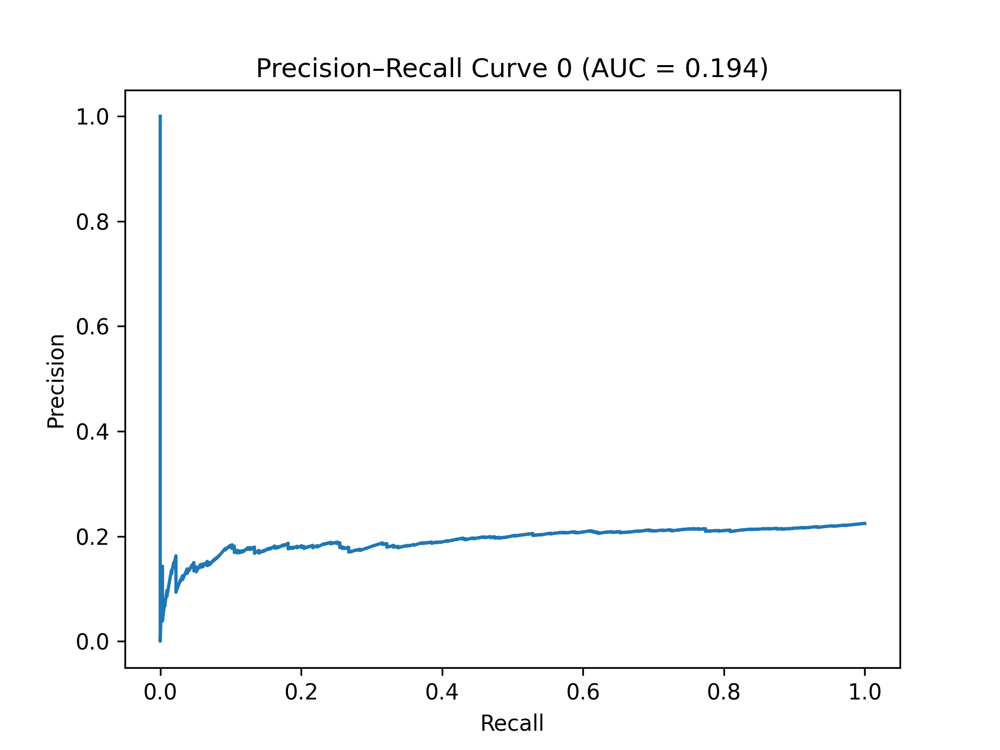
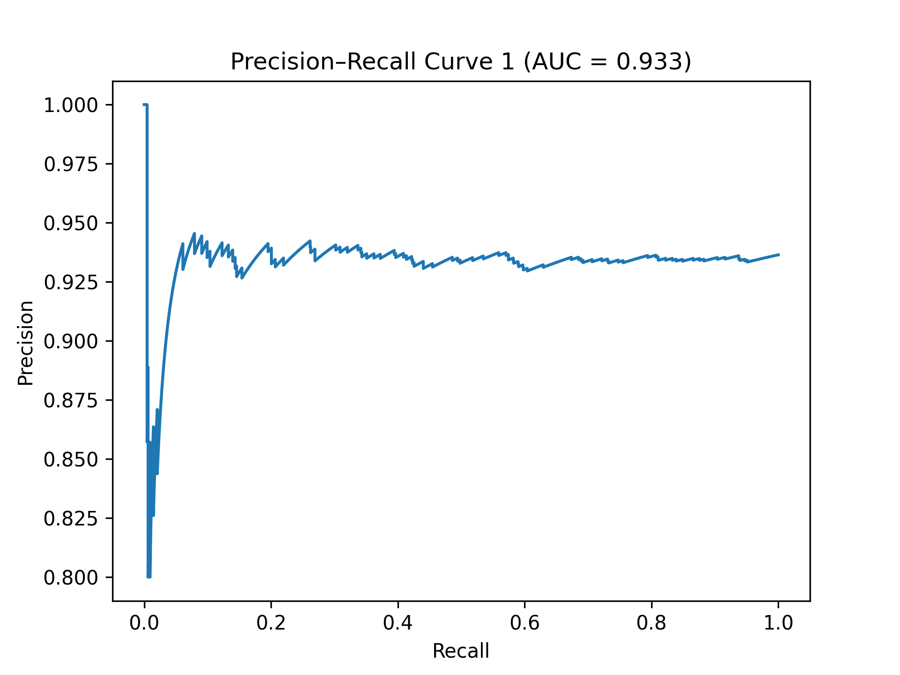
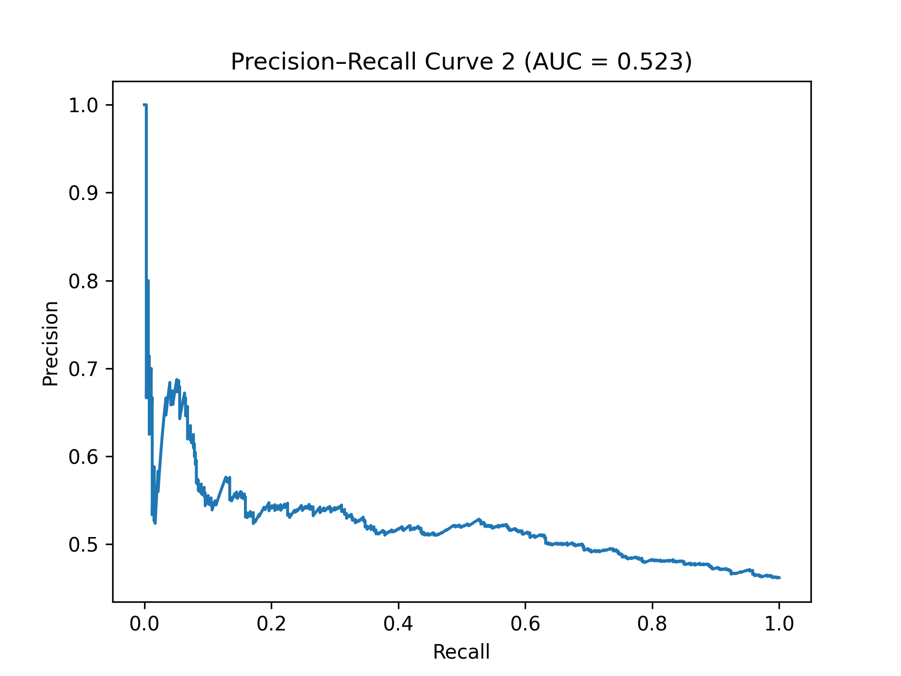
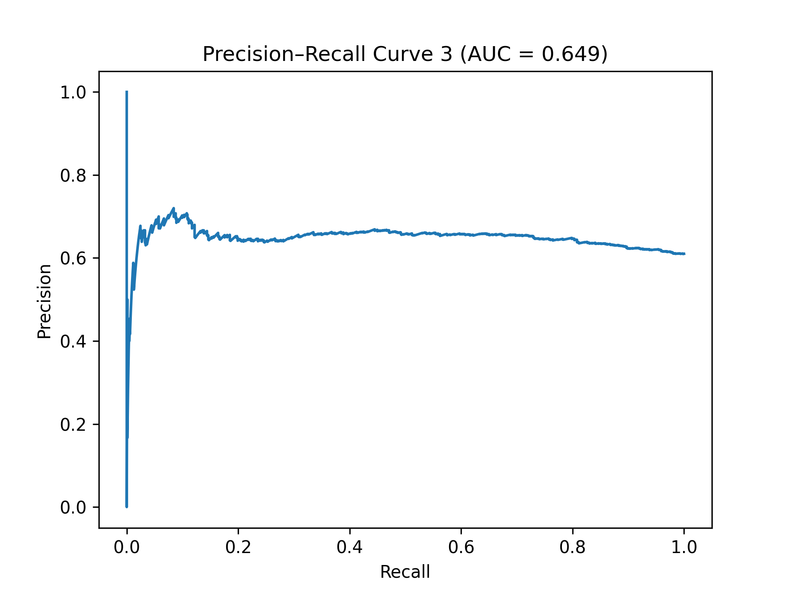

# ML-Final-Project

# Predicting Personality from Text: MBTI vs. Big Five

This project investigates to what extent personality traits can be inferred from short-form online text using machine learning, and how predictive performance differs between categorical personality frameworks (MBTI) and continuous trait frameworks (Big Five / OCEAN). Using Reddit posts as naturalistic text data, we fine-tune ***BERT-based models*** to predict personality dimensions directly from language.

Our results show that personality prediction consistently exceeds chance, confirming that online language contains weak but detectable personality signals. Performance is stronger for MBTI, where stable categorical boundaries simplify prediction, while Big Five regression proves more challenging due to its continuous nature and the noise inherent in short, informal posts. Overall, pretrained transformers reliably extract psychologically meaningful cues from social media text.

---

## Project Description

**BERT (Bidirectional Encoder Representations from Transformers)** is a pretrained language model we chose to apply for our problem task. Key features of the model include:
- **Bidirectional context**: Understands words based on left and right context
- **Transformer-based**: Uses self-attention to capture long-range dependencies 
- **Pretrained**: Learns general language patterns from large corpora 
- **Fine-tunable**: Can be adapted for downstream tasks like classification

As Reddit posts and texts contain nuanced language, BERT captures semantic relationships and context, making it ideal for personality prediction. For the final milestone, we use `bert-base-uncased` compared to `prajjwal1/bert-tiny` used during initial milestone to improve predictions and for large datasets.

---

## Dataset Requirements

### MBTI Dataset (Reddit)

- **File:** `data/reddit_post.csv`  
- **Source:** Kaggle Reddit MBTI Dataset  
  https://www.kaggle.com/datasets/minhaozhang1/reddit-mbti-dataset  
- **Required Columns:**  
  - `mbti` – MBTI type (e.g., INTJ, ENFP)  
  - `body` – Reddit post text  
- **Preprocessing & Encoding:**  
  - Balanced across all 16 MBTI personality types to mitigate class imbalance
      - `data/balanced/balanced_data.csv`
      - `data/balanced/test_balanced.csv`
      - `data/balanced/train_balanced.csv`
      - `data/balanced/val_balanced.csv`
  - Converted 16-class MBTI labels into **four independent binary labels**: E/I, S/N, T/F, J/P  
- **Data Split:**  
  - 70% training  
  - 10% validation  
  - 20% test
     
This formulation reframes MBTI prediction as **four parallel binary classification tasks**, improving training stability, interpretability, and per-dimension evaluation.

---

### Big Five (OCEAN) Dataset (Reddit)

- **Files:** `big5_train.csv`, `big5_validation.csv`, `big5_test.csv`  
- **Source:** Pandora-Big5 Reddit Dataset (Hugging Face)  
  https://huggingface.co/datasets/jingjietan/pandora-big5  
- **Required Columns:**  
  - `text` – Reddit post text  
  - `O` – Openness score (continuous)  
  - `C` – Conscientiousness score (continuous)  
  - `E` – Extraversion score (continuous)  
  - `A` – Agreeableness score (continuous)  
  - `N` – Neuroticism score (continuous)  
- **Preprocessing:**  
  - Sampled ~150,000 posts for computational feasibility  
  - Trait scores were treated as **continuous regression targets** and normalized using `MinMaxScaler`  
- **Data Split:**  
  - 70% training  
  - 10% validation  
  - 20% test  


---
## Model Architecture

Both models use **BERT (Devlin et al., 2019)** as a pretrained encoder to extract contextualized embeddings from Reddit posts.

---

### MBTI Model

- **Architecture:** `BertForSequenceClassification`  
- **Task:** Multi-label classification  
- **Outputs:** 4 logits corresponding to each MBTI dimension:  
  - E/I, S/N, T/F, J/P  
- **Loss Function:** Binary Cross-Entropy Loss with class weighting to address label imbalance  
- **Evaluation Metrics:**  
  - Accuracy per dimension  
  - Precision–Recall AUC (PR AUC) per dimension  

---

### Big Five (OCEAN) Model

- **Architecture:** BERT encoder + custom regression head  
- **Task:** Multi-output regression  
- **Outputs:** Continuous trait scores for:  
  - Openness (O), Conscientiousness (C), Extraversion (E), Agreeableness (A), Neuroticism (N)  
- **Loss Function:** Smooth L1 (Huber) Loss  
- **Evaluation Metrics:**  
  - Mean Squared Error (MSE) per trait  
  - Mean Absolute Error (MAE) per trait  
  - R² per trait  
- **Optional Analysis:** Continuous predictions were **binned** for precision–recall curve evaluation  

---

### Common Training Setup

- **Optimizer:** AdamW  
- **Early Stopping:** Patience = 2 epochs  
- **Learning Rate Scheduling:** ReduceLROnPlateau  


Example code:

```python
for epoch in range(NUM_EPOCHS):
    for batch in train_loader:
        optimizer.zero_grad()
        input_ids = batch[0].to(DEVICE)
        attention_mask = batch[1].to(DEVICE)
        labels = batch[2][:, i].to(DEVICE)

        outputs = model(
            input_ids=input_ids,
            attention_mask=attention_mask,
            labels=labels
        )
        loss = outputs.loss
        loss.backward()
        optimizer.step()
```
## Evaluation

- Accuracy is computed per dimension using `sklearn.metrics.accuracy_score`.  
- Batch tokenization is used for efficiency.  
- Independent evaluation highlights which MBTI dimensions are easier or harder to predict.

---

## Prediction

Steps to predict a new post:

1. Tokenize the text  
2. Feed it into each trained model  
3. Map binary outputs to MBTI letters  
4. Concatenate letters for the final MBTI type

**Example:**

```

---

## Configuration

```python
NUM_EPOCHS = 2
MAX_LEN = 128
BATCH_SIZE = 8
MODEL_NAME = "prajjwal1/bert-tiny"
DEVICE = "cuda" if torch.cuda.is_available() else "cpu"
```

`NUM_EPOCHS` – training epochs
`MAX_LEN` – maximum token length
`BATCH_SIZE` – batch size
`MODEL_NAME` – pretrained BERT variant


## Running the script


```
python model.py

```
Load and preprocess the dataset
Train four BERT classifiers (one per MBTI dimension)
Evaluate each model
Predict the MBTI type for a sample post

 ## Our Output
 ```
  Training model for E_I...
  Some weights of BertForSequenceClassification were not initialized from the model checkpoint at prajjwal1/bert-tiny and are newly initialized: ['classifier.bias', 'classifier.weight']
  You should probably TRAIN this model on a down-stream task to be able to use it for predictions and inference.
  Epoch 1 done, Loss: 0.6925
  Epoch 2 done, Loss: 0.7044
  Epoch 3 done, Loss: 0.7487
  
  Evaluating model...
  Accuracy: 0.5986
  PR AUC:  0.1944
  
  Training model for S_N...
  Some weights of BertForSequenceClassification were not initialized from the model checkpoint at prajjwal1/bert-tiny and are newly initialized: ['classifier.bias', 'classifier.weight']
  You should probably TRAIN this model on a down-stream task to be able to use it for predictions and inference.
  Epoch 1 done, Loss: 0.5469
  Epoch 2 done, Loss: 0.3736
  Epoch 3 done, Loss: 0.5740
  
  Evaluating model...
  Accuracy: 0.5764
  PR AUC:  0.9330
  
  Training model for T_F...
  Some weights of BertForSequenceClassification were not initialized from the model checkpoint at prajjwal1/bert-tiny and are newly initialized: ['classifier.bias', 'classifier.weight']
  You should probably TRAIN this model on a down-stream task to be able to use it for predictions and inference.
  Epoch 1 done, Loss: 0.6766
  Epoch 2 done, Loss: 0.6377
  Epoch 3 done, Loss: 0.6287
  
  Evaluating model...
  Accuracy: 0.5529
  PR AUC:  0.5233
  
  Training model for J_P...
  Some weights of BertForSequenceClassification were not initialized from the model checkpoint at prajjwal1/bert-tiny and are newly initialized: ['classifier.bias', 'classifier.weight']
  You should probably TRAIN this model on a down-stream task to be able to use it for predictions and inference.
  Epoch 1 done, Loss: 0.6997
  Epoch 2 done, Loss: 0.7109
  Epoch 3 done, Loss: 0.6770
  
  Evaluating model...
  Accuracy: 0.5429
  PR AUC:  0.6491
  
  Post: Ok ya not sure if this model is actually predicting anything
  Predicted MBTI: ISTP
  
  Post: I love leading teams and planning long-term goals.
  Predicted MBTI: ENTP
  
  Post: I really enjoy spending time alone thinking about ideas.
  Predicted MBTI: ISTJ
  
  Post: whatever this is sooo annoying
  Predicted MBTI: INTP
  
  Post: Wait Im actually so excited for thiss
  Predicted MBTI: ISFP
 ```

 ## Our Evaluation Graphs


**Figure 1:** E/I Precision-Recall Curve



**Figure 2:** S/N Precision-Recall Curve



**Figure 3:** T/F Precision-Recall Curve



**Figure 4:** J/P Precision-Recall Curve

## Replication Instructions
**Environment Setup**
1. Clone this repository:
   ```
   git clone git@github.com:paigemizutani/ML-Final-Project.git
   ```
   ```
   cd ML-Final-Project
   ```
2. Install the required libraries:
   ```
   pip install torch transformers datasets pandas numpy scikit-learn matplotlib seaborn scipy tqdm
   ```
3. Prepare the Datasets
   MBTI
   - The balanced MBTI datasets used in our experiments is already included in the repository as preprocessed CSV files under data/balanced.
   - These files were generated during development and are provided to allow direct replication of results without rerunning data_setup.py.
   - To reproduce our results, no additional MBTI data setup is required.
   Big Five
   - The Pandora-Big5 Reddit dataset is loaded automatically using the Hugging Face datasets library in our script.
   - All preprocessing, sampling (150k posts), and train/validation/test splitting are handled within big5_model.py.
   - No manual dataset download or preparation is required.
 
 ## Future Directions

Future work could improve generalization by training on more diverse text sources beyond Reddit, such as blogs, essays, or social media platforms with longer-form content. Additionally, cross-framework analysis could explore correlations between MBTI dimensions and Big Five traits to identify shared linguistic signals and better understand how categorical and continuous personality models relate. Finally, incorporating demographic metadata (e.g., age groups or online communities) could help determine whether personality cues are expressed differently across populations.

---

## Contributions

This project was completed collaboratively, with both group members working together on all stages of the project, including dataset selection, model development, training, evaluation, visualization, analysis, and poster preparation. Work sessions were conducted jointly, and responsibilities were shared throughout.
- **Total estimated time**: 40 hours


